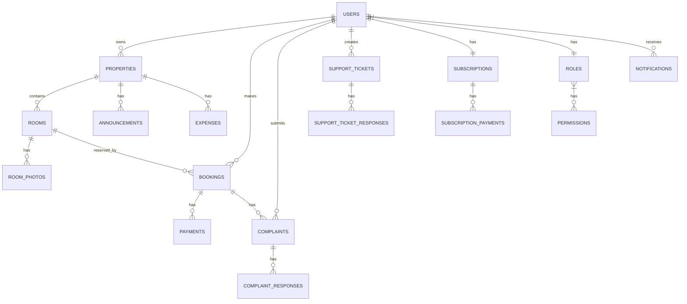

Sekarang saya akan mendokumentasikan model database dalam format markdown. Dokumentasi ini akan mencakup semua tabel, atribut, tipe data, dan relasi antar tabel yang telah didefinisikan sebelumnya.

Sekarang saya akan mendokumentasikan model database dalam format markdown:

# Dokumentasi Model Database Juragan Kost

## Daftar Isi
1. [Pengenalan](#pengenalan)
2. [Diagram ER](#diagram-er)
3. [Struktur Tabel](#struktur-tabel)
4. [Relasi Antar Tabel](#relasi-antar-tabel)
5. [Model Laravel](#model-laravel)

## Pengenalan

Dokumen ini menjelaskan struktur database untuk aplikasi Juragan Kost, platform manajemen kos digital yang menghubungkan Pemilik Kos, Penyewa, dan Administrator dalam satu ekosistem terintegrasi.

## Diagram ER

Berikut adalah diagram Entity Relationship (ER) yang menggambarkan hubungan antar entitas dalam database Juragan Kost:

## Struktur Tabel

### 1. Tabel `users`
| Kolom | Tipe Data | Deskripsi |
|-------|-----------|-----------|
| id | bigint | Primary key |
| name | string | Nama pengguna |
| email | string | Email pengguna (unik) |
| password | string | Password terenkripsi |
| phone | string | Nomor telepon (opsional) |
| role | enum | Peran pengguna (super_admin, admin, owner, tenant, staff) |
| profile_photo_path | string | Path foto profil (opsional) |
| email_verified_at | timestamp | Waktu verifikasi email (opsional) |
| remember_token | string | Token untuk fitur "remember me" |
| created_at | timestamp | Waktu pembuatan |
| updated_at | timestamp | Waktu pembaruan |

### 2. Tabel `roles`
| Kolom | Tipe Data | Deskripsi |
|-------|-----------|-----------|
| id | bigint | Primary key |
| name | string | Nama peran (unik) |
| created_at | timestamp | Waktu pembuatan |
| updated_at | timestamp | Waktu pembaruan |

### 3. Tabel `permissions`
| Kolom | Tipe Data | Deskripsi |
|-------|-----------|-----------|
| id | bigint | Primary key |
| name | string | Nama izin (unik) |
| created_at | timestamp | Waktu pembuatan |
| updated_at | timestamp | Waktu pembaruan |

### 4. Tabel `role_has_permissions` (pivot)
| Kolom | Tipe Data | Deskripsi |
|-------|-----------|-----------|
| role_id | bigint | Foreign key ke tabel roles |
| permission_id | bigint | Foreign key ke tabel permissions |

### 5. Tabel `model_has_roles` (pivot)
| Kolom | Tipe Data | Deskripsi |
|-------|-----------|-----------|
| role_id | bigint | Foreign key ke tabel roles |
| model_type | string | Tipe model (biasanya App\Models\User) |
| model_id | bigint | ID model (biasanya user_id) |

### 6. Tabel `properties`
| Kolom | Tipe Data | Deskripsi |
|-------|-----------|-----------|
| id | bigint | Primary key |
| owner_id | bigint | Foreign key ke tabel users |
| name | string | Nama properti |
| description | text | Deskripsi properti (opsional) |
| address | string | Alamat properti |
| city | string | Kota |
| province | string | Provinsi |
| postal_code | string | Kode pos (opsional) |
| latitude | decimal(10,7) | Koordinat latitude (opsional) |
| longitude | decimal(10,7) | Koordinat longitude (opsional) |
| property_type | enum | Tipe properti (kos_putra, kos_putri, kos_campur) |
| total_rooms | integer | Total kamar |
| available_rooms | integer | Kamar tersedia |
| facilities | json | Fasilitas properti (opsional) |
| rules | json | Peraturan properti (opsional) |
| is_active | boolean | Status aktif |
| is_featured | boolean | Status ditonjolkan |
| created_at | timestamp | Waktu pembuatan |
| updated_at | timestamp | Waktu pembaruan |

### 7. Tabel `rooms`
| Kolom | Tipe Data | Deskripsi |
|-------|-----------|-----------|
| id | bigint | Primary key |
| property_id | bigint | Foreign key ke tabel properties |
| name | string | Nama kamar |
| description | text | Deskripsi kamar (opsional) |
| room_type | string | Tipe kamar |
| floor | integer | Lantai (opsional) |
| size | string | Ukuran kamar (opsional) |
| price_monthly | decimal(12,2) | Harga per bulan |
| price_quarterly | decimal(12,2) | Harga per 3 bulan (opsional) |
| price_yearly | decimal(12,2) | Harga per tahun (opsional) |
| facilities | json | Fasilitas kamar (opsional) |
| is_available | boolean | Status ketersediaan |
| created_at | timestamp | Waktu pembuatan |
| updated_at | timestamp | Waktu pembaruan |

### 8. Tabel `room_photos`
| Kolom | Tipe Data | Deskripsi |
|-------|-----------|-----------|
| id | bigint | Primary key |
| room_id | bigint | Foreign key ke tabel rooms |
| photo_path | string | Path foto |
| is_primary | boolean | Status foto utama |
| created_at | timestamp | Waktu pembuatan |
| updated_at | timestamp | Waktu pembaruan |

### 9. Tabel `bookings`
| Kolom | Tipe Data | Deskripsi |
|-------|-----------|-----------|
| id | bigint | Primary key |
| room_id | bigint | Foreign key ke tabel rooms |
| tenant_id | bigint | Foreign key ke tabel users |
| booking_code | string | Kode booking (unik) |
| check_in_date | date | Tanggal check-in |
| check_out_date | date | Tanggal check-out |
| duration | integer | Durasi dalam bulan |
| total_price | decimal(12,2) | Total harga |
| status | enum | Status booking (pending, confirmed, cancelled, completed) |
| payment_status | enum | Status pembayaran (unpaid, partially_paid, paid) |
| created_at | timestamp | Waktu pembuatan |
| updated_at | timestamp | Waktu pembaruan |

### 10. Tabel `payments`
| Kolom | Tipe Data | Deskripsi |
|-------|-----------|-----------|
| id | bigint | Primary key |
| booking_id | bigint | Foreign key ke tabel bookings |
| payment_code | string | Kode pembayaran (unik) |
| amount | decimal(12,2) | Jumlah pembayaran |
| payment_method | string | Metode pembayaran |
| payment_date | timestamp | Tanggal pembayaran (opsional) |
| due_date | timestamp | Tanggal jatuh tempo (opsional) |
| status | enum | Status pembayaran (pending, success, failed, expired) |
| payment_proof | string | Bukti pembayaran (opsional) |
| payment_details | json | Detail pembayaran (opsional) |
| created_at | timestamp | Waktu pembuatan |
| updated_at | timestamp | Waktu pembaruan |

### 11. Tabel `subscriptions`
| Kolom | Tipe Data | Deskripsi |
|-------|-----------|-----------|
| id | bigint | Primary key |
| owner_id | bigint | Foreign key ke tabel users |
| plan | string | Paket langganan |
| price_per_room | decimal(8,2) | Harga per kamar |
| start_date | date | Tanggal mulai |
| end_date | date | Tanggal berakhir |
| status | enum | Status langganan (active, inactive, cancelled) |
| payment_status | enum | Status pembayaran (unpaid, paid) |
| created_at | timestamp | Waktu pembuatan |
| updated_at | timestamp | Waktu pembaruan |

### 12. Tabel `subscription_payments`
| Kolom | Tipe Data | Deskripsi |
|-------|-----------|-----------|
| id | bigint | Primary key |
| subscription_id | bigint | Foreign key ke tabel subscriptions |
| payment_code | string | Kode pembayaran (unik) |
| amount | decimal(12,2) | Jumlah pembayaran |
| payment_method | string | Metode pembayaran |
| payment_date | timestamp | Tanggal pembayaran (opsional) |
| due_date | timestamp | Tanggal jatuh tempo (opsional) |
| status | enum | Status pembayaran (pending, success, failed, expired) |
| payment_proof | string | Bukti pembayaran (opsional) |
| payment_details | json | Detail pembayaran (opsional) |
| created_at | timestamp | Waktu pembuatan |
| updated_at | timestamp | Waktu pembaruan |

### 13. Tabel `complaints`
| Kolom | Tipe Data | Deskripsi |
|-------|-----------|-----------|
| id | bigint | Primary key |
| booking_id | bigint | Foreign key ke tabel bookings |
| tenant_id | bigint | Foreign key ke tabel users |
| title | string | Judul keluhan |
| description | text | Deskripsi keluhan |
| photo_path | string | Path foto (opsional) |
| status | enum | Status keluhan (pending, in_progress, resolved, rejected) |
| resolved_at | timestamp | Waktu penyelesaian (opsional) |
| created_at | timestamp | Waktu pembuatan |
| updated_at | timestamp | Waktu pembaruan |

### 14. Tabel `complaint_responses`
| Kolom | Tipe Data | Deskripsi |
|-------|-----------|-----------|
| id | bigint | Primary key |
| complaint_id | bigint | Foreign key ke tabel complaints |
| user_id | bigint | Foreign key ke tabel users |
| response | text | Respons keluhan |
| created_at | timestamp | Waktu pembuatan |
| updated_at | timestamp | Waktu pembaruan |

### 15. Tabel `announcements`
| Kolom | Tipe Data | Deskripsi |
|-------|-----------|-----------|
| id | bigint | Primary key |
| property_id | bigint | Foreign key ke tabel properties |
| title | string | Judul pengumuman |
| content | text | Isi pengumuman |
| is_published | boolean | Status publikasi |
| published_at | timestamp | Waktu publikasi (opsional) |
| created_at | timestamp | Waktu pembuatan |
| updated_at | timestamp | Waktu pembaruan |

### 16. Tabel `expenses`
| Kolom | Tipe Data | Deskripsi |
|-------|-----------|-----------|
| id | bigint | Primary key |
| property_id | bigint | Foreign key ke tabel properties |
| category | string | Kategori pengeluaran |
| amount | decimal(12,2) | Jumlah pengeluaran |
| description | text | Deskripsi pengeluaran (opsional) |
| expense_date | date | Tanggal pengeluaran |
| receipt_photo | string | Path foto kwitansi (opsional) |
| created_at | timestamp | Waktu pembuatan |
| updated_at | timestamp | Waktu pembaruan |

### 17. Tabel `support_tickets`
| Kolom | Tipe Data | Deskripsi |
|-------|-----------|-----------|
| id | bigint | Primary key |
| user_id | bigint | Foreign key ke tabel users |
| ticket_code | string | Kode tiket (unik) |
| subject | string | Subjek tiket |
| description | text | Deskripsi tiket |
| priority | enum | Prioritas (low, medium, high) |
| status | enum | Status tiket (open, in_progress, resolved, closed) |
| resolved_at | timestamp | Waktu penyelesaian (opsional) |
| created_at | timestamp | Waktu pembuatan |
| updated_at | timestamp | Waktu pembaruan |

### 18. Tabel `support_ticket_responses`
| Kolom | Tipe Data | Deskripsi |
|-------|-----------|-----------|
| id | bigint | Primary key |
| ticket_id | bigint | Foreign key ke tabel support_tickets |
| user_id | bigint | Foreign key ke tabel users |
| response | text | Respons tiket |
| created_at | timestamp | Waktu pembuatan |
| updated_at | timestamp | Waktu pembaruan |

### 19. Tabel `notifications`
| Kolom | Tipe Data | Deskripsi |
|-------|-----------|-----------|
| id | bigint | Primary key |
| user_id | bigint | Foreign key ke tabel users |
| title | string | Judul notifikasi |
| content | text | Isi notifikasi |
| type | string | Tipe notifikasi |
| is_read | boolean | Status dibaca |
| read_at | timestamp | Waktu dibaca (opsional) |
| created_at | timestamp | Waktu pembuatan |
| updated_at | timestamp | Waktu pembaruan |

## Relasi Antar Tabel

### Relasi One-to-One
1. User (Owner) - Subscription

### Relasi One-to-Many
1. User (Owner) - Properties
2. User (Tenant) - Bookings
3. User (Tenant) - Complaints
4. User - SupportTickets
5. User - Notifications
6. User - ComplaintResponses
7. User - SupportTicketResponses
8. Property - Rooms
9. Property - Announcements
10. Property - Expenses
11. Room - RoomPhotos
12. Room - Bookings
13. Booking - Payments
14. Booking - Complaints
15. Subscription - SubscriptionPayments
16. Complaint - ComplaintResponses
17. SupportTicket - SupportTicketResponses

### Relasi Many-to-Many
1. User - Roles (melalui model_has_roles)
2. Role - Permissions (melalui role_has_permissions)

## Model Laravel

Berikut adalah daftar model Laravel yang digunakan dalam aplikasi Juragan Kost:

1. User
2. Role
3. Permission
4. Property
5. Room
6. RoomPhoto
7. Booking
8. Payment
9. Subscription
10. SubscriptionPayment
11. Complaint
12. ComplaintResponse
13. Announcement
14. Expense
15. SupportTicket
16. SupportTicketResponse
17. Notification

Setiap model memiliki atribut dan relasi yang sesuai dengan struktur tabel database yang telah didefinisikan sebelumnya.