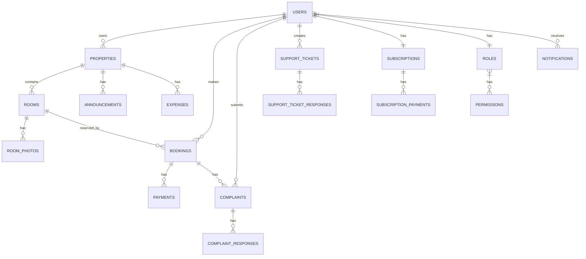

Sekarang saya akan membuat diagram ER untuk visualisasi model database dan mendefinisikan atribut dan tipe data untuk setiap tabel secara lebih detail. Saya akan menggunakan sintaks Mermaid untuk membuat diagram ER.

Untuk diagram ER, saya akan fokus pada entitas utama dan hubungan antar entitas yang telah diidentifikasi sebelumnya. Diagram ini akan menunjukkan tabel-tabel utama dan hubungan antar tabel.

Kemudian, saya akan mendefinisikan atribut dan tipe data untuk setiap tabel secara lebih detail, sesuai dengan standar Laravel migration.

Sekarang saya akan membuat diagram ER untuk visualisasi model database dan mendefinisikan atribut dan tipe data untuk setiap tabel secara lebih detail.

### Diagram ER (Entity Relationship)

Berikut adalah diagram ER yang menggambarkan hubungan antar entitas utama dalam database Juragan Kost:



### Definisi Atribut dan Tipe Data untuk Setiap Tabel

#### 1. Tabel `users`
```php
Schema::create('users', function (Blueprint $table) {
    $table->id();
    $table->string('name');
    $table->string('email')->unique();
    $table->string('password');
    $table->string('phone')->nullable();
    $table->enum('role', ['super_admin', 'admin', 'owner', 'tenant', 'staff'])->default('tenant');
    $table->string('profile_photo_path', 2048)->nullable();
    $table->timestamp('email_verified_at')->nullable();
    $table->rememberToken();
    $table->timestamps();
});
```

#### 2. Tabel `roles`
```php
Schema::create('roles', function (Blueprint $table) {
    $table->id();
    $table->string('name')->unique();
    $table->timestamps();
});
```

#### 3. Tabel `permissions`
```php
Schema::create('permissions', function (Blueprint $table) {
    $table->id();
    $table->string('name')->unique();
    $table->timestamps();
});
```

#### 4. Tabel `role_has_permissions` (pivot)
```php
Schema::create('role_has_permissions', function (Blueprint $table) {
    $table->foreignId('role_id')->constrained()->onDelete('cascade');
    $table->foreignId('permission_id')->constrained()->onDelete('cascade');
    $table->primary(['role_id', 'permission_id']);
});
```

#### 5. Tabel `properties`
```php
Schema::create('properties', function (Blueprint $table) {
    $table->id();
    $table->foreignId('owner_id')->constrained('users')->onDelete('cascade');
    $table->string('name');
    $table->text('description')->nullable();
    $table->string('address');
    $table->string('city');
    $table->string('province');
    $table->string('postal_code')->nullable();
    $table->decimal('latitude', 10, 7)->nullable();
    $table->decimal('longitude', 10, 7)->nullable();
    $table->enum('property_type', ['kos_putra', 'kos_putri', 'kos_campur']);
    $table->integer('total_rooms')->default(0);
    $table->integer('available_rooms')->default(0);
    $table->json('facilities')->nullable();
    $table->json('rules')->nullable();
    $table->boolean('is_active')->default(true);
    $table->boolean('is_featured')->default(false);
    $table->timestamps();
});
```

#### 6. Tabel `rooms`
```php
Schema::create('rooms', function (Blueprint $table) {
    $table->id();
    $table->foreignId('property_id')->constrained()->onDelete('cascade');
    $table->string('name');
    $table->text('description')->nullable();
    $table->string('room_type');
    $table->integer('floor')->nullable();
    $table->string('size')->nullable();
    $table->decimal('price_monthly', 12, 2);
    $table->decimal('price_quarterly', 12, 2)->nullable();
    $table->decimal('price_yearly', 12, 2)->nullable();
    $table->json('facilities')->nullable();
    $table->boolean('is_available')->default(true);
    $table->timestamps();
});
```

#### 7. Tabel `room_photos`
```php
Schema::create('room_photos', function (Blueprint $table) {
    $table->id();
    $table->foreignId('room_id')->constrained()->onDelete('cascade');
    $table->string('photo_path');
    $table->boolean('is_primary')->default(false);
    $table->timestamps();
});
```

#### 8. Tabel `bookings`
```php
Schema::create('bookings', function (Blueprint $table) {
    $table->id();
    $table->foreignId('room_id')->constrained()->onDelete('cascade');
    $table->foreignId('tenant_id')->constrained('users')->onDelete('cascade');
    $table->string('booking_code')->unique();
    $table->date('check_in_date');
    $table->date('check_out_date');
    $table->integer('duration'); // dalam bulan
    $table->decimal('total_price', 12, 2);
    $table->enum('status', ['pending', 'confirmed', 'cancelled', 'completed'])->default('pending');
    $table->enum('payment_status', ['unpaid', 'partially_paid', 'paid'])->default('unpaid');
    $table->timestamps();
});
```

#### 9. Tabel `payments`
```php
Schema::create('payments', function (Blueprint $table) {
    $table->id();
    $table->foreignId('booking_id')->constrained()->onDelete('cascade');
    $table->string('payment_code')->unique();
    $table->decimal('amount', 12, 2);
    $table->string('payment_method');
    $table->timestamp('payment_date')->nullable();
    $table->timestamp('due_date')->nullable();
    $table->enum('status', ['pending', 'success', 'failed', 'expired'])->default('pending');
    $table->string('payment_proof')->nullable();
    $table->json('payment_details')->nullable();
    $table->timestamps();
});
```

#### 10. Tabel `subscriptions`
```php
Schema::create('subscriptions', function (Blueprint $table) {
    $table->id();
    $table->foreignId('owner_id')->constrained('users')->onDelete('cascade');
    $table->string('plan');
    $table->decimal('price_per_room', 8, 2);
    $table->date('start_date');
    $table->date('end_date');
    $table->enum('status', ['active', 'inactive', 'cancelled'])->default('active');
    $table->enum('payment_status', ['unpaid', 'paid'])->default('unpaid');
    $table->timestamps();
});
```

#### 11. Tabel `subscription_payments`
```php
Schema::create('subscription_payments', function (Blueprint $table) {
    $table->id();
    $table->foreignId('subscription_id')->constrained()->onDelete('cascade');
    $table->string('payment_code')->unique();
    $table->decimal('amount', 12, 2);
    $table->string('payment_method');
    $table->timestamp('payment_date')->nullable();
    $table->timestamp('due_date')->nullable();
    $table->enum('status', ['pending', 'success', 'failed', 'expired'])->default('pending');
    $table->string('payment_proof')->nullable();
    $table->json('payment_details')->nullable();
    $table->timestamps();
});
```

#### 12. Tabel `complaints`
```php
Schema::create('complaints', function (Blueprint $table) {
    $table->id();
    $table->foreignId('booking_id')->constrained()->onDelete('cascade');
    $table->foreignId('tenant_id')->constrained('users')->onDelete('cascade');
    $table->string('title');
    $table->text('description');
    $table->string('photo_path')->nullable();
    $table->enum('status', ['pending', 'in_progress', 'resolved', 'rejected'])->default('pending');
    $table->timestamp('resolved_at')->nullable();
    $table->timestamps();
});
```

#### 13. Tabel `complaint_responses`
```php
Schema::create('complaint_responses', function (Blueprint $table) {
    $table->id();
    $table->foreignId('complaint_id')->constrained()->onDelete('cascade');
    $table->foreignId('user_id')->constrained()->onDelete('cascade');
    $table->text('response');
    $table->timestamps();
});
```

#### 14. Tabel `announcements`
```php
Schema::create('announcements', function (Blueprint $table) {
    $table->id();
    $table->foreignId('property_id')->constrained()->onDelete('cascade');
    $table->string('title');
    $table->text('content');
    $table->boolean('is_published')->default(false);
    $table->timestamp('published_at')->nullable();
    $table->timestamps();
});
```

#### 15. Tabel `expenses`
```php
Schema::create('expenses', function (Blueprint $table) {
    $table->id();
    $table->foreignId('property_id')->constrained()->onDelete('cascade');
    $table->string('category');
    $table->decimal('amount', 12, 2);
    $table->text('description')->nullable();
    $table->date('expense_date');
    $table->string('receipt_photo')->nullable();
    $table->timestamps();
});
```

#### 16. Tabel `support_tickets`
```php
Schema::create('support_tickets', function (Blueprint $table) {
    $table->id();
    $table->foreignId('user_id')->constrained()->onDelete('cascade');
    $table->string('ticket_code')->unique();
    $table->string('subject');
    $table->text('description');
    $table->enum('priority', ['low', 'medium', 'high'])->default('medium');
    $table->enum('status', ['open', 'in_progress', 'resolved', 'closed'])->default('open');
    $table->timestamp('resolved_at')->nullable();
    $table->timestamps();
});
```

#### 17. Tabel `support_ticket_responses`
```php
Schema::create('support_ticket_responses', function (Blueprint $table) {
    $table->id();
    $table->foreignId('ticket_id')->constrained('support_tickets')->onDelete('cascade');
    $table->foreignId('user_id')->constrained()->onDelete('cascade');
    $table->text('response');
    $table->timestamps();
});
```

#### 18. Tabel `notifications`
```php
Schema::create('notifications', function (Blueprint $table) {
    $table->id();
    $table->foreignId('user_id')->constrained()->onDelete('cascade');
    $table->string('title');
    $table->text('content');
    $table->string('type');
    $table->boolean('is_read')->default(false);
    $table->timestamp('read_at')->nullable();
    $table->timestamps();
});
```